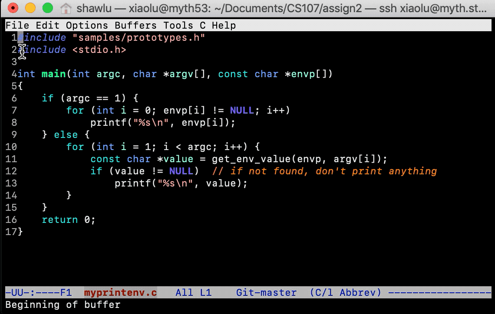
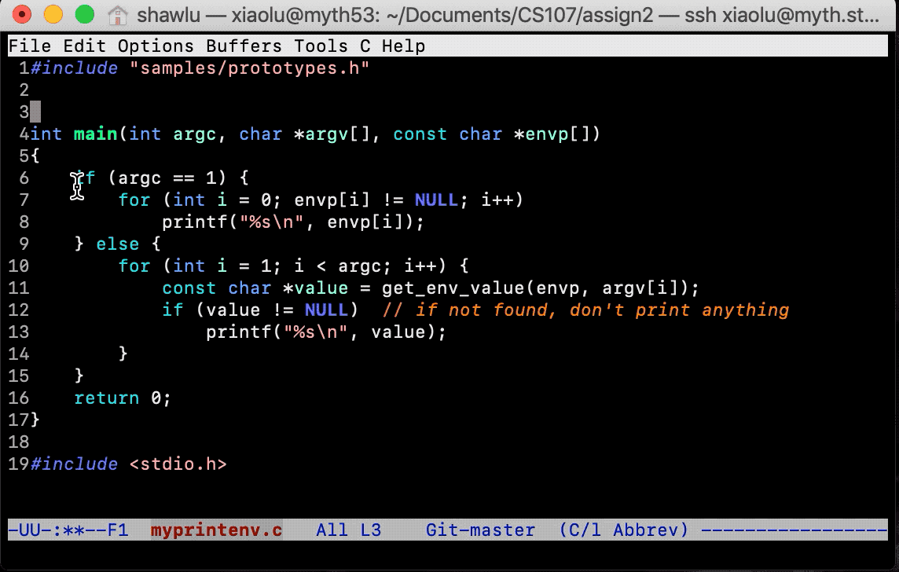
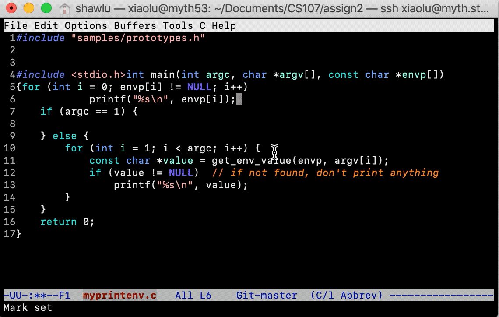

### Basic Emacs Command

#### Capital Letter Key
* C: <kbd>Control</kbd> (on Mac)
* M: <kbd>Command</kbd> (on Mac)

#### Execute Command
Press Control or Command key, then a letter key. For example, to move to beginning of line (**C-a**), press <kbd>Control</kbd> and <kbd>a</kbd>.

#### Single-Line Copy-Paste
* Step 1: <kbd>Control</kbd>+<kbd>k</kbd> (**C-k**) **cut** everything **after** the cursor into clipboard.
* Step 2: move cursor to desired location.
* Step 3: <kbd>Control</kbd>+<kbd>y</kbd> (**C-y**) paste from clipboard.

    

#### Multi-Line Copy-Paste
* Step 1: use cursor to select region to copy.
* Step 2: <kbd>Control</kbd>+<kbd>w</kbd>( **C-w**) cut wthe selected region.
* Step 3: move cursor to desired location.
* Step 4: <kbd>Control</kbd>+<kbd>y</kbd> (**C-y**) paste from clipboard.

    

#### Life Saver: Undo
* <kbd>Control</kbd>+<kbd>-</kbd> (**C--**) undo

    

