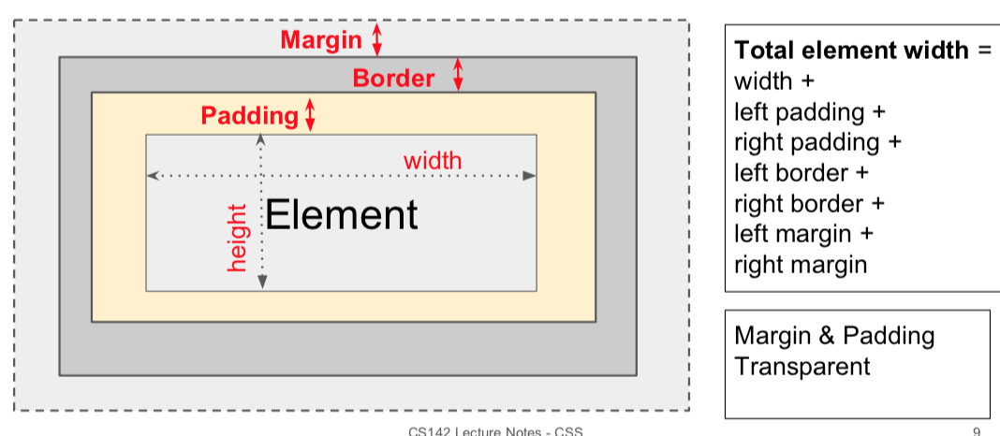

## Key Concepts
<a name="top">

___
### Week 1
#### HTML [PDF](HTML.pdf)
* Starting and ending tag: `<p></p>`
* XHTML: more strict about adhering to proper syntax (more detail page 19).
* Basic structure:
    * `<head>`: Contains miscellaneous things such as page title, CSS stylesheets, etc.
        * Common tags: `<title>, <link>, <script>`
    * `<body`: the main body of the document.
        * Common tags: `<h1>, <p>, <ol>, <ul>, <li>, <i>, <b>, , <br>, <a href="...">, <!-- comments -->`.

#### CSS [PDF](CSS.pdf)
* Specify class in HTML: `<span class="test">`
* DRY Principle: Don't Repeat yourself.
* Box model


* Selectors:


* Pseudo selectors (hover, link, visited):
```CSS
p:hover, a:hover {
      background-color: yellow;
}
a:visited {
    color: green;
}
a:link {
    color: blue;
}
```
* Difference between **flexbox** and **grid** layout (page 15)
* multiple matches hierarchy: tag -> class -> ID > inline.
* Three ways to import CSS: separate style sheet; page specific (HTML body); inline element-specific (page 17).
    * import style sheet: `<link rel="stylesheet" type="text/css" href="myStyles.css" />`
    * page specific:
    ```HTML
    <style type="text/css">
    body {
        font-family: Tahoma, Arial, sans-serif;
    }
    </style>
    ```
    * element specific: `<div style="padding:2px; ... ">`
