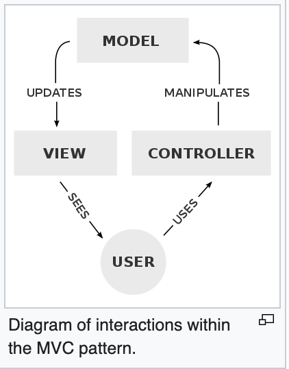
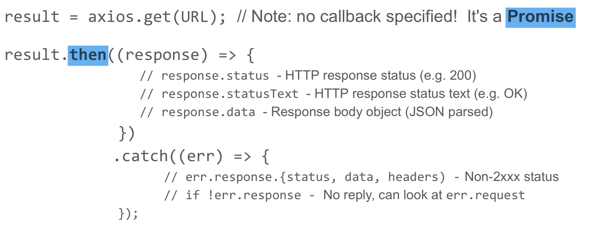
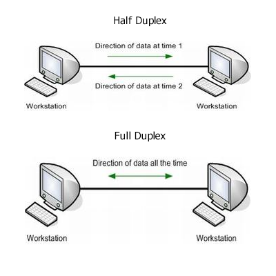

### Week 5
#### Building Web Applications [WebApps.pdf](WebApps.pdf)
* What are Boostrap and Material-UI? (page 7).
* How does Material-UI grid help simplify front-end layout? (page 9).
* How are Material-UI breakpoints sizes defiend and what are they used for? (page 14).
* Difference between unit testing and end-to-end testing (page 19).
* Deep linking with React Route:
    * Use exact path to set default view: `<Route exact path="/" component={Example}/>`.
    * Conditional rendering based on URL: `<Route path="/states" component={States}/>`.
    * Create clickable link: `<Link to="/states"><button type="button" className="button">Switch to States!</button></Link>`.

#### HyperText Transport Protocol [HTTP.pdf](HTTP.pdf)
* Defaults: port 80, index.html
    - Receives TCP/IP connection
* Broswer sends `GET` request to server, and read a `RESPONSE`.
* Familiarize with components of HTTP request (page 4):
    - Header: Method, URL, Protocol version...
    - Body: ...
    - Sample HTTP response (page 6)
* Familiarize with differences in HTTP method (page 5):
    - RESTful: `POST`, `GET`, `PUT`, `DELETE` (C, R, U, D respectively).
    - Less useful: `HEAD`
* Browser chaching Control
    - Cache-Control: max-age = 120 (within 2mins it will use cache)
    - frequently used to fetch static contents (images, templates, CSS)
    - reduce startup latency; but changes may not be picked up right away

####  Controller/server communication [ServerCom.pdf](ServerCom.pdf)

* "Controller's job to fetch model for the view" (page 2).
    - browser talking to a web server, asking for model
    - early approach: have the browser do HTTP request (DOM extension, XMLHttpRequest)
    - now can do HTTP request without switching page
* AJAX: Asynchronous JavaScript and XML (often used with JSON)
* XMLHttpRequest [link](https://developer.mozilla.org/en-US/docs/Web/API/XMLHttpRequest)
    - handler function is passed as `XMLHttpRequest.onreadystatechange` parameter in the XMLHttpRequest.
    `readyState` can range 0 ~ 4 (page 4), called at different stages of the request.
    - Response:
        - `responseText`raw text can be HTML or JavaScript or **JSON** (preferred)
        - `reponseXML` (XML document).
* REST: representational state transfer.
    - export resources to clients using unique names (**URIs**)
    - "stateless": easy for load balancing.
    - clients communicate CRUD operations via HTTP methods.
    - **axios** is a popular Promise-based HTTP client (page 10).


> You can retrieve data from a URL without having to do a full page refresh. This enables a Web page to update just part of a page without disrupting what the user is doing. XMLHttpRequest is used heavily in AJAX programming.

* Promise
  - callbacks: pyramid of doom
  - alternative to callbacks: individual functions; but sequential execution jumps from function to function, not ideal
  - so use promise:
    - rather than specifying a callback
     ``doSomething(args, callback)``
    -use a promise that will be filled in when done

```JavaScript
var donePromise = doSomething(args)
donePromise.then(function(value) {
  //value is the promised result when successful
}, function (error) {
  //error case
});    

```
axios.get(URL) returns a promise

```JavaScript

changeUserList() {
  console.log('/user/list/' + this.state.advanced);
  axios.get('/user/list/' + this.state.advanced)
  .then((response) => {
    //response.data is a string type; JSON.parse decodes it into an array of dictionary
    console.log(response.data);
    this.setState({userList: response.data});
  })
  .catch((error) => {
    this.handleAlertOpen();
    this.setState({error: error});
  });
}
```
  - chaining promises
```JavaScript
return myReadFile(fileName)
  .then(function (fileData) { return doSomethingOnData(fileData); })
  .then(function (data) { return finalizeData(data); })
  .catch(errorHandlingFunc);
```
  - arrow function
  ```JavaScript
  return myReadFile(fileName)
    .then((fileData) => doSomethingOnData(fileData))
    .then((data) => finalizeData(data))
    .catch(errorHandlingFunc);
  ```
* Callbacks & Promises interchange
  - easy to go from promise to callback: ``axios.get(URL).then(callback)``
  - going from callback to promise requires creating new promises
    ```JavaScript
    var newPromise = new Promise(function(fulfil, reject){
      //calls fulfil(value) to have promise return value
      //calls reject(err) to have promise signal error
    });
    ```


* WebSocket: two-way communication with a remote host ([intro](https://www.websocket.org/aboutwebsocket.html)).
    - Used for streaming.
    - `onopen` is called when TCP connection is established with server.
    - `onmessage` is called when a message is received from the server.
    - Full-duplex: data can be transmitted in both directions on a signal carrier at the same time.
    - Support upstream, downstream communication.



* Remote Procedure Call (RPC)
    - More flexible than REST API, can accepts function that draw multiple resources.
    - Can use HTTP or WebSocket to send RPC.
* GraphQL.
    - Must specify a API.
    - Client send HTTP request with parameters.

___
#### "Minor" Digression: Promises [ServerCom.pdf](ServerCom.pdf)
* Return a promise that will be filled in when done.
* `axios.get()` returns a promise.
* Promises can be chained (ES6 JavaScript arrow functions).
* The returned value of previous function becomes the input of the promise.

Template:
```JavaScript
// donePromise will be filled in when operation completes
var donePromise = doSomething(args);

donePromise.then(function (value) {
    // value is the promised result when successful
}, function (error) {
    // Error case
});
```

The below codes are equivalent:
```JavaScript
// chained
return myReadFile(fileName)
    .then(function (fileData) { return doSomethingOnData(fileData); })
    .then(function (data) { return finalizeData(data); })
    .catch(errorHandlingFunc);

// arrow chain
return myReadFile(fileName)
    .then((fileData) => doSomethingOnData(fileData))
    .then((data) => finalizeData(data))
    .catch(errorHandlingFunc);

// normal
let file = ReadFile(fileName);
let data = doSomethingOnData(file);
let moreData = doSomethingMoreOnData(data); return finalizeData(moreData);
```

##### Promise - Callback Conversion
* Converting callback -> promises: `axios.get(url).then(callback)`
* Converting promises -> callback requires:
    1. Instantiating a new promise object: `new Promise`
    2. Constructor takes **a anonymous function** as parameter, that takes **two named functions** as parameter (one for success, one for failure).

```JavaScript
return new Promise(function (fulfill, reject) {
     fs.readFile(filename, function (err, res) {
       if (err) eject(err);
       else fulfill(res);
   });
});
```

___
#### Web Servers [WebServers.pdf](WebServers.pdf)
* low-level innermost loop
Server loop forever doing:
1. accept TCP connection from browser
2. read HTTP request from TCP connection
3. process HTTP request
4. write HTTP response to TCP connection
5. shutdown TCP connection (except if Connection: keep-alive)

Under JavaScript design framework, server computation stress is light:
* Most files are static.
* Data operation is done by database engine (DBMS).
* Server only needs to maintain session info, unpack requests, and pack response.
