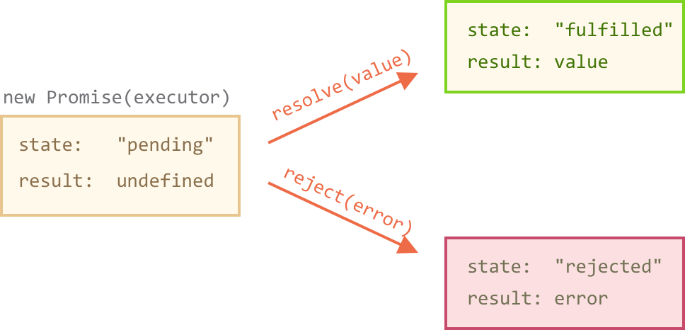

### Promisifying XMLHttpRequest
* [[Tutorial](https://javascript.info/promise-basics)].
* `function get(url)` returns a Promise object.
* the anonymous function `function(resolve, reject)` is called the executor.
* When the promise is created, this executor function runs automatically.
* When the executor finishes the job, it should call one of the functions that it gets as arguments: `resolve`, `reject`.
* The function `resolve`, `reject` set *two* internal state of the promise:
    - `state` — initially “pending”, then changes to either “fulfilled” or “rejected”,
    - `result` — an arbitrary value of your choosing, initially undefined.
* The executor should call only one resolve or one reject. The promise’s state change is final.



* **THEN** syntax:
```JavaScript
promise.then(
  function(result) { /* handle a successful result */ },
  function(error) { /* handle an error */ }
);
```
* The first argument of .then is a function that:
    - runs when the Promise is resolved, and
    - receives the result.
* The second argument of .then is a function that:
    - runs when the Promise is rejected, and
    - receives the error.

##### Example Use Case
```JavaScript
function get(url) {
  // Return a new promise.
  return new Promise(function(resolve, reject) {
    // Do the usual XHR stuff
    var req = new XMLHttpRequest();
    req.open('GET', url);

    req.onload = function() {
      // This is called even on 404 etc
      // so check the status
      if (req.status == 200) {
        // Resolve the promise with the response text
        resolve(req.response);
      }
      else {
        // Otherwise reject with the status text
        // which will hopefully be a meaningful error
        reject(Error(req.statusText));
      }
    };

    // Handle network errors
    req.onerror = function() {
      reject(Error("Network Error"));
    };

    // Make the request
    req.send();
  });
}

get('story.json').then(function(response) {
  console.log("Success!", response);
}, function(error) {
  console.error("Failed!", error);
})
```
