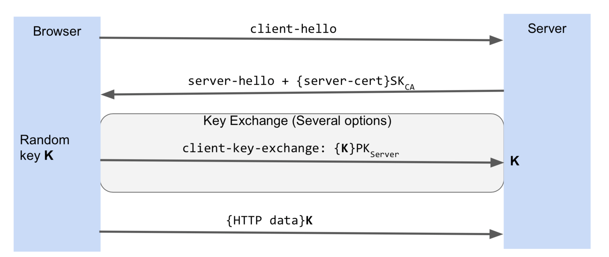

### Week 8 Security

#### Web App Security ([WebAppSecurity.pdf](WebAppSecurity.pdf))
* Attack through our app
  - leak information of a user
  - act on user's behalf
  - attack the user's machine
  - attack whatever the user's machine can talk to

* Threat Model: types of attack.

* Modes of Attacks
  - through the connection between browser and server
    - steal password
    - hijack existing connection
  - through the server
    - inject bad code to the server
  - through browser
    - inject bad code to the browser
  - breach browser and attack user machine
  - phishing

* Defense measure: make sure can explain those concepts
  - isolation
    - web run in isolated sandbox
    - sandbox: an isolated testing environment (test before a program goes live)
    - challenges
      - many sources, not equally trusted
      - trusted and untrusted sources are in close proximity
      - must separate various forms of contents
  - cryptography
    - protect info from unauthorized viewing
    - determine changes
    - determine the origin of info
  web development framework
  - use helpful patterns
  - same-origin policy, frames, origins
    - **origin: protocol + domain name + port**
    - restrict communication between different frames
    - apply to DOM, cookies, XMLHttpRequest, AJAX requests
    - doesn't apply to ``<script>`` tags; JS executes with full privileges of the enclosing frame
    - restriction: when needing to use sub-domain; can fix with ``document.domain = "company.com"``
    - postMessage - sender from a domain a.com to a embedded frame of different domain; receiver domain b.com can check the origin of the domain. ``if (e.origin == "http://a.com")``
    -restrict also cookies

#### Network Attacks ([NetworkAttacks.pdf](NetworkAttacks.pdf))
* attack: passive (eavesdrop)/ active (inject network packets, modify packets, reorder&replay packets, block packets)
* public key encryption vs. symmetric key encryption
  - The main disadvantage of the symmetric key encryption is that all parties involved have to exchange the key used to encrypt the data before they can decrypt it.
  - A public key is made freely available to anyone who might want to send you a message. The second private key is kept a secret so that you can only know.
  - encrypt with public key but only principle can access; if encrypt with secret key, it is sent from principle
  - public key: slower
* Certificate authority: produces certificates (which is a document encrypted with secret key of a certificate authority)
  - first service sends public key to certificate authority
  - certificate authority gives certificate to Service
  - service sends certificate to users
*  HTTPS, Secure Sockets Layer (SSL) & Transport Layer Security (TLS)
  - SSL & TLS are the standard technology for keeping an internet connection secure and safeguarding any sensitive data that is being sent between two systems (the client and the server, or the server and server)
  - one-way only: server doesn't know the browser
  - attack: SSL stripping (change HTTPS to HTTP) & mixed contents (due to over specified URL) & login page with HTTP (solution: before server returns HTML, check for HTTPS)

#### Session Attack ([SessionAttacks.pdf](SessionAttacks.pdf))
* Session state: used to control access in web servers (for example a login info stored in request); usually derived from cookies in the request header
* Session hijack: guess out predictable session id
  - Session ID needs to be unpredictable.
  - Use HTTPS
  - Change session ID after any change in privilege / security level.
* Cookies
  - Sent with all HTTP request
  - concurrently running websites can request the server (through cookies?)

* Cross site request forgery (CSRF): how does hacker gets session ID.
  - When you first visit a website (e.g. a bank) and then the attacker's site, the attacker's site will submit a form to your bank. When the form gets submitted, the browser includes the bank's web app cookies, including the session id. The form can be an iframe that is invisible.
* Data tampering
  - can't trust what's returned to the server
  - solution1: only use returned info as a hint
  - solution2: use encryption to detect (MACs)
* Message authentication code (MAC):
  - **authentication**: know we (server) sent out the data.
  - **integrity**: know the data have not been modified.
  - **confidentiality**: add encryption. (need all three? encrypt then MACs)
  - both data and MAC are transmitted.
  - detect data tampering (server uses secret key to check)

#### Code Injection ([CodeInjection.pdf](CodeInjection.pdf))
* Great intorduction: [link](https://excess-xss.com)
* Cross Site Scripting (XSS)
* Stored Cross Site Scripting Attack
  * Inject JavaScript file via `<script>` tag (when input can be formatted with HTML)

* Reflected Cross Site Scripting Attack (**unclear**)

> The second and the most common type of XSS is Reflected XSS (Non-persistent XSS). In this case, the attacker’s payload has to be a part of the request that is sent to the web server. It is then reflected back in such a way that the HTTP response includes the payload from the HTTP request. Attackers use malicious links, phishing emails, and other social engineering techniques to lure the victim into making a request to the server. The reflected XSS payload is then executed in the user’s browser.

> Reflected XSS is not a persistent attack, so the attacker needs to deliver the payload to each victim. These attacks are often made using social networks.

* Server side attack: SQL injection. (modify the database)

#### Phishing Attack ([PhishingAttacks.pdf](PhishingAttacks.pdf))
* Imitate legitimate sites. Trick users into entering personal info.
* Counter measure
  - Lock symbol (but (1) not very obvious; (2) too easy to obtain the certificate)
  - Extended certification
    - certificate authority should vet applicants.
    - certification undergone audits
    - special indicator for extended certificates
    - problem: too costly and too long for small companies
  - Server should monitor abnormal activities: sudden spikes in download, password change, money transfer...

#### Denial of Service([DOSAttacks.pdf](DOSAttacks.pdf))
* Using up all resources (bandwidth, network sockets):
  - uploading huge files
  - sending many requests quickly
* Distributed DOS (DDOS): use a **botnet** of machines to send heavy traffic.
* Solution:
  - set quota for users
  - page 4
