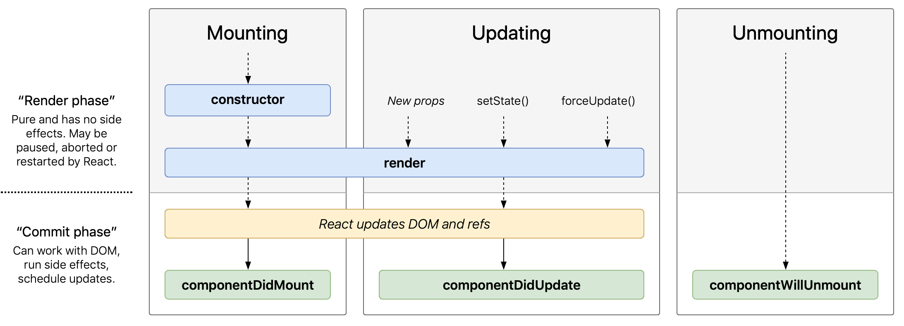

### Week 8 Cloud Computing

#### Large-scale Web application
* Scale-out v.s. Scale-up
  - Scale-out: expand capacity by adding more instances
  - Scale-up: switch to a bigger instance (which will soon hit limits)

* Pros & Cons of Scale-out
  - benefit1: can easily delete or add instances to fit needs
  - benefit2: naturally redundant, one instance dies other lives
  - challenge: manage and distribute work to multiple instances

* How does scale-out work
  - 1. browsers want to speak to the server through HTTP (IP/TCP)
  - 2. use load balancing to distribute requests
    - **HTTP redirection** front end machine -> back-end machines
    - **DNS (Domain Name System) load balancing**
      - DNS is like a phone book that translate the domain name to IP address
      - When a domain has multiple servers, it will return a list of servers (specify multiple targets), and use a round-robin method to distribute it to users (handle a geographically distributed system). DNS system rotates among these systems

    - **Load balancing switch (Layer 4-7 Switch)**
      - incoming packets pass through load balancer switch between browsers and servers
      - load balancer directs TCP connection request to one of the server
      - load balancer will send all packets for that connection to the same server
      - in some cases can detect session cookies and go to the same server
      - **stateless server** easier to handle; requires database shared by all servers
      - distributed randomly or estimated on load

  - 3. use super efficient web server - **nginX** (HTTP)
    - load balancing
    - handles front-end servers coming and going, fault tolerant (one server dies, just quit it)
    - handle simples requests (file)
    - DOS mitigation - request rate limits
    - popular to shield node.js

  - 4. WebSockets bind browsers and web servers and cannot load balance each request

* Scale-out storage system
  - traditionally, relational DB (a single DB instance)
  - now **data sharding**: each piece a data shard; can tolerate failure by replication
  - applications must petition data among multiple databases (more complexity)

* **Memcache**
  - key-value store (both blobs)
    - store query and result as key-value pair.
  - Doesn't help with write (post) request, which goes to DBMS.
  - on particular memchache servers (don't need to access database)
  - writes must go to DBMS, so no improvemnt
  - cache misses hurt performance
  - must manage consistency in software (when update in BD flush to memcache)

**Virtualization**
* What can be turned into virtual machine images: LB, WS, DB, MC.
* Decoupled from physical machines.

**Other than virtual machine**
* Container (e.g. Docker): specify program dependencies and give it to cloud provider
* Cloud storage & database
* Serverless
  * Define function and trigger.
  * Cloud Storage: Google Spanner, AWS Dynamo
  * AWS Lambda; Microsoft Azure Functions, Google Cloud Functions;  
* Content Distribution Network: store read-only part
  * DNS route URL to closest server  

Short Question
* NGinx helps with (A) scaling up (B) scaling out.
* What does "stateless server" mean?
* What does "serverless computing " mean?
* Give two examples of load distribution.
* Advantage of cloud service (in general)?

___
#### Data Centers
* Rack:
  * U is standard unit: 1.75 inch
  * length: 42U
  * width: 19 or 23 inches
* Switch: top-of-rack switch -> end-of-row switch -> core router
* Power usage effectiveness: total facility power / (server & router power)
* Save electricity cost: cool air, evaporate water
* backup power: generator, fuel tanks, fuel trucks
* fault tolerance: multiple copies of data, across network connections, across racks
* 
