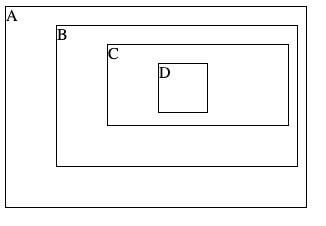

### Event Propagation

#### Key concepts:
* Capture vs bubble phase.
* Stop propagation.
* Stop immediate propagation.
* Target vs current target.

HTML: [practice_12.html](../sample_codes/practice_12.html)

#### Problem 1
JavaScript: [practice_12_p1.js](../sample_codes/practice_12_p1.js)

What is the target and currentTarget when user click A, B, C, and D?

For each activated listener, what is the `target` and `currentTarget`?

#### Problem 2
JavaScript: [practice_12_p2.js](../sample_codes/practice_12_p2.js)

What is the sequence of event when user clicks D?

For each activated listener, what is the `target` and `currentTarget`?

#### Problem 3
JavaScript: [practice_12_p3.js](../sample_codes/practice_12_p3.js)

What is the sequence of event when user clicks D?

What is the sequence of event when user clicks C?

For each activated listener, what is the `target` and `currentTarget`?

#### Problem 4
JavaScript: [practice_12_p4.js](../sample_codes/practice_12_p4.js)

What is the sequence of event when user clicks D?

What is the sequence of event when user clicks C?

For each activated listener, what is the `target` and `currentTarget`?

#### Problem 5
JavaScript: [practice_12_p5.js](../sample_codes/practice_12_p5.js)

What is the sequence of event when user clicks D?

What is the sequence of event when user clicks C?

For each activated listener, what is the `target` and `currentTarget`?

#### Problem 6
JavaScript: [practice_12_p6.js](../sample_codes/practice_12_p6.js)

What is the sequence of event when user clicks D?

What is the sequence of event when user clicks C?

For each activated listener, what is the `target` and `currentTarget`?
