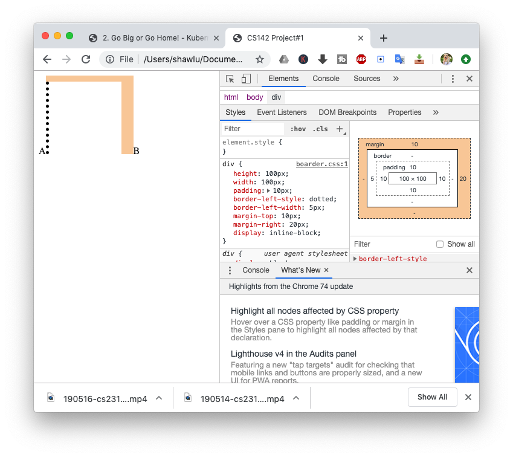
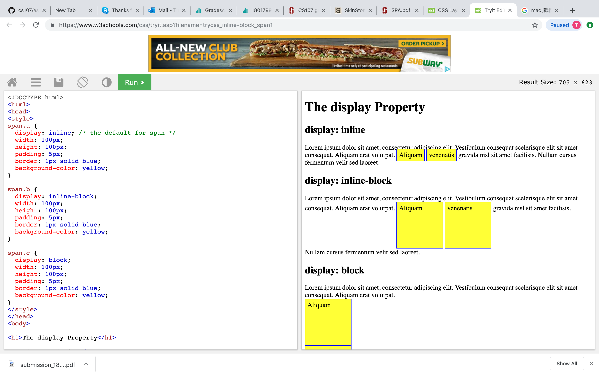
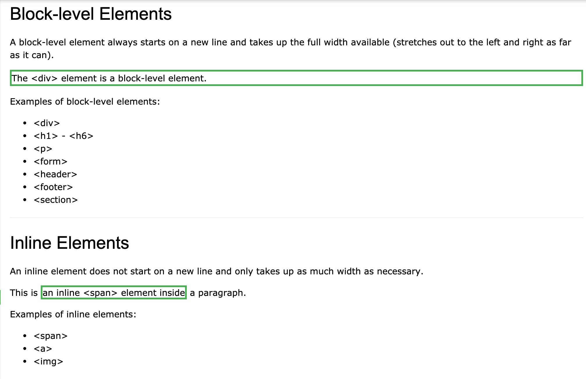
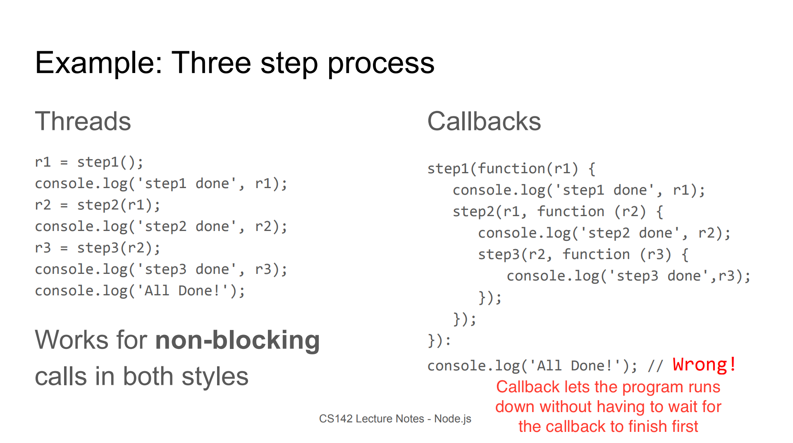

### 错题集

#### Mid-term

**Problem 1.B** CSS Border & Display: inline-block Properties
* When the direction of a border is specified, only that direction gets applied CSS styling.

* Block, inline-block and inline are different display values:

* The default display for `<div>` is block, while the default display for `<span>` is inline.



**Problem 2.B** Deep Linking
* Concept: the URL can capture some session state so that directing the
browser to the URL will result the app's execution to that context.
* It doesn't require SPA.

**Problem 4.B2** Special Characters in URL
* Characters other than numbers and English alphabets should be represented as %XX, where XX is the hexadecimal value of the character.

**Problem 5** URL Navigation
* Relative path: when a URL is navigated through a relative path (e.g. `<a href="123.html">`), keep all of the original URL but change the last component of the hierarchical component.
* Absolute path: when a URL is navigated through a relative path (e.g. `<a href="/123.html">`), replace the entire hierarchical component.
* Fragment component: when a URL is navigated through a fragment (e.g. `<a href="#c">`), add the fragment component at the end.
* Full URL: with a full URL (e.g. `<a href="http://google.com">`), it will be navigated to the full URL.

**Problem 6** SetState in Render
* SetSate in Render results in an infinite loop between the render and setState, for each time setState is called, it will cause the class to render, which again calls the setState.

**Problem 7** Add Text and Attributes in DOM Elements
* Add text to an element: `p.textContent = "text"`.
* Add id to an element: `p.id = "id"`.
* Add class to an element: `p.className = "class"` (rather than class).
* Add style to an element: `p.style.visibility = "hidden"`.

**Problem 9** Target and CurrentTarget
* Still not entirely sure...

**Problem 11** Prototype
* You can change the methods of an instance of a class, and such changes do not affect other instances.
* But when you change a method with prototype, it changes all instances.

**Problem 12** Unit Test and End-to-End Test
* End-to-End test is where you test the whole application.
* Unit test is where you test a specific function of a single component.

**Problem 13** Let and variable
* Let does not hoist while var hoists.
* After a for `(i = 0; i < n; i++)` loop finishes, i is n rather than n-1.
* Without a var hoist, after the for loop finishes, the i is no longer present.

**Problem 14** Instance, Prototype and Constructor
* Functions and properties defined in JavaScript are all stored in some objects, among which three important ones are instance, prototype and constructor.

**Problem 15** Global Variable
* Do not declare global variables in functions. They will be overwritten.

**Problem 16** Callback
* Callback's form:
```JavaScript
setTimeout(callback, 1000*x);
```
 or
 ```JavaScript
 setTimeout(function(){console.log(x);}, 1000*x);
 ```
A form like
```JavaScript
setTimeout(callback(x), 1000*x);
```
will not work as a callback since it is a call of a function.
* Callback is able to deal with time block.

* A function looks for the value of a variable in their own memory stack first. If no value is found, it goes to the memory of the owner of the function to look for the value. If it is still not found, it goes to the owner of the owner of the function. It goes on.
* Callback is tricky in terms of its variables:
Take ProblemA for example,
```JavaScript
for (var x = 1, x < 5; x++) {
  setTimeout(function(){console.log(x), 1000 * x});
}
```
It will print out 5, 5, 5, 5.
The x in `console.log(x)` can only find its value in the for loop outside `setTimeout()`. Therefore, it prints the result of the x in the for loop. Moreover, since the `function(){console.log(X)}` is a callback function, it lets the for loop keep running. Therefore, the x turns 5 before the callback function finishes. Therefore, in the end, it prints out all 5s.
As for ProblemB,
```JavaScript
function f(a) {console.log(a);}
for (var x = 1, x < 5; x++) {
  setTimeout(function(){f(x)}, 1000 * x});
}
```
It is exactly the same as ProblemA. While function `f(a){console.log(a);}` is called in `setTimeout()` as an function, it is called inside the callback function. This does not change the fact that x has to look for its value from without, that is, in the for loop.

___
#### Practice Midterms

**201703 P8**
* div.class1 means a <div> with class1. This can only apply to a single div element. A <div> containing other elments (e.g. <span>) with class1 does not count.

**201706 P8**
* Relative unit: em, rem, %
* Absolute unit: px

**201606 P1**
**201603 P7**
* relative: relative to the "normal position"
* absolute: relative to the closest ancestor, and the element is not part of the normal flow of document
* fixed: relative to the viewport
